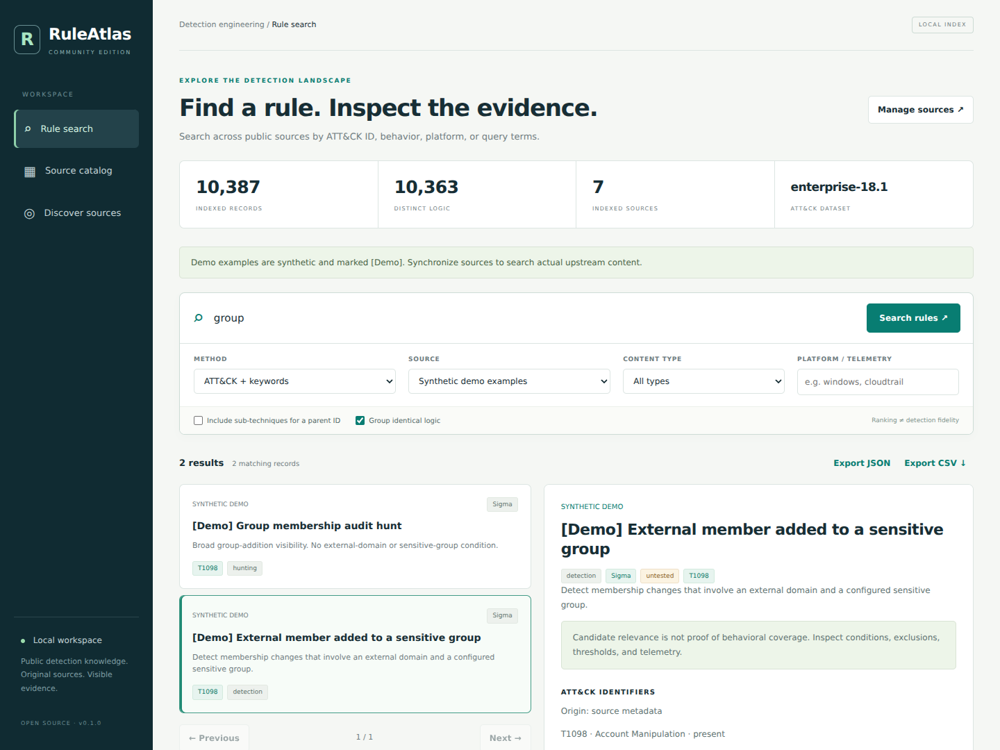

# RuleAtlas

**Vendor-neutral discovery of public detection rules, with original logic and visible source evidence.**

RuleAtlas is an independent, MIT-licensed community project. Run it locally, search a unified index, inspect original queries and dependencies, and maintain a source catalog using six evidence checks. No account or AI API key is needed for local search. A GitHub token is optional for discovery and archive revision lookup.



## Problem statement

Public detection content is spread across vendor and community repositories, with different formats, naming conventions, ATT&CK mappings, prerequisites and maintenance practices. Detection teams repeatedly search these repositories, inspect similar rules and trace their origins before deciding whether a candidate fits a use case.

RuleAtlas brings configured public sources into one local, searchable index. It helps users find candidate detection content by ATT&CK ID or keywords, inspect the original logic and source revision, and record the evidence needed to assess each source. Behavioral suitability still requires an analyst's review.

## Who it is for

| User | How RuleAtlas helps |
|---|---|
| Detection engineers | Find existing public logic and inspect telemetry, macros and runtime dependencies before adapting a candidate. |
| Threat hunters and SOC analysts | Find hunting and detection candidates associated with a technique, tool name or scenario keyword. |
| Security architects | Explore public approaches to a proposed use case and inspect their telemetry prerequisites. |
| Security researchers | Trace candidate content to its author, repository, original file and exact revision. |
| Open-source contributors and learners | Explore different detection formats and contribute source adapters, evidence and fixes. |

## How it helps

- Search configured sources through one interface instead of repeating repository-by-repository lookups.
- Keep original logic and exact source links available while reviewing candidates.
- Reduce repeated review of identical logic through grouping that retains source provenance.
- Record ownership, adoption, engineering quality, maintenance, traceability and validation evidence separately.
- Export candidates to CSV or JSON for follow-up analysis and collaboration.

Example workflow: search `T1059.001`, filter by source or telemetry, inspect the returned PowerShell-related candidates, review dependencies and supporting lines, then export a shortlist. Searching `lockbit` finds literal mentions in indexed titles, descriptions and logic; it does not guarantee every behavior associated with that ransomware is found.

**Scope:** RuleAtlas is an independent public detection-content discovery tool. It contains no internal-policy comparison workflow, requires no internal company repositories, and makes no claim that retrieval ranking measures detection effectiveness.

Maintainers: see [Publish RuleAtlas on GitHub](docs/publishing.md) for upload, repository setup and release steps.

## Quick start on Windows

1. Install a stable **Python 3.11 or newer** from [python.org](https://www.python.org/downloads/). Confirm `py -3 --version` or `python --version` reports a supported version in a new terminal. Git is optional; HTTPS archive sync is the default.
2. Download this repository using **Code → Download ZIP**, or use a release ZIP. Extract it completely to a short path such as `C:\Tools\RuleAtlas`. Open the folder containing `start_windows.bat` and `pyproject.toml`.
3. Double-click **`start_windows.bat`**. It creates a virtual environment and installs PyYAML if needed.
4. Open **http://127.0.0.1:8765** after the terminal says the server is ready.

The first launch creates eight clearly labeled synthetic examples. Open **Source catalog**, select a small set of repositories, and click **Sync selected sources** to load real upstream content. For a quick first live import, try **CTID Cloud Analytics**, **Google SecOps**, and **Falco**. Leave the terminal open while using the app. Stop it with Ctrl+C.

For an explicit Windows setup, run these commands in PowerShell from the project folder. Activation is unnecessary:

```powershell
py -3 -m venv .venv
.\.venv\Scripts\python.exe -m pip install -r requirements.txt
.\.venv\Scripts\python.exe tests\self_check.py
.\.venv\Scripts\python.exe -m ruleatlas demo
.\.venv\Scripts\python.exe -m ruleatlas serve
```

If `py` is unavailable but `python --version` reports 3.11 or newer, use `python` for the first command. `demo` loads synthetic examples; omit it when you only want upstream content. `verify_windows.bat` is also available for offline tests. The normal app needs Python, PyYAML and a browser; Node.js and Playwright are only needed to run browser development tests.

## macOS / Linux

Install a stable Python 3.11+ and confirm `python3 --version`. Download and extract the project, then open a terminal in its root folder:

```bash
sh start_unix.sh
```

Or use any supported Python environment:

```bash
python -m pip install -e .
python -m ruleatlas demo
python -m ruleatlas serve
```

## What works in v0.1.3

- Local browser interface and command-line search.
- **25 seed repositories**, an editable catalog, and a form to add more sources.
- GitHub repository discovery with explicit result-limit and review status.
- HTTPS archive and selective-file downloads, optional Git synchronization, and offline directory ingestion.
- Format adapters for Sigma, SPL YAML, Elastic TOML, Sentinel YAML, Panther, Falco, Sublime MQL, YARA/YARA-L, Wazuh XML, community KQL code blocks, network signatures, capa, and source references.
- Exact tactic/technique/sub-technique ID search, keyword ranking, and ATT&CK-plus-keyword filtering.
- Optional sub-technique expansion, source/type/telemetry filters, pagination, and identical-logic grouping.
- Original query text, authors, references, maturity, file path, revision permalink, license metadata, and explicit validation state.
- Editable source assessments for all six credibility checks.
- Literal scenario-evidence inspection with matching line numbers and an explicit manual-review requirement.
- Versioned ATT&CK download/import from MITRE's official STIX repository. One domain/release is selected at a time.
- CSV and JSON export; CSV values are escaped to reduce spreadsheet formula injection.
- Atomic per-source index replacement. Failed imports preserve the previous snapshot and produce a detailed local error report.

This is a **local evaluation release**, not a multi-user hosted service. The interface binds to `127.0.0.1`; do not expose the standard-library development server publicly.

## Search accurately

| Mode | Behavior |
|---|---|
| ATT&CK + keywords | Explicit IDs filter candidates; other words rank the remaining records using SQLite FTS5/BM25. |
| Keywords | Lexical search across titles, descriptions and source logic. Multiple terms retrieve candidates matching any term, ranked by relevance. |
| Exact ATT&CK ID | Match an ID such as `T1059.001`; parent expansion is off unless selected. Tactic IDs can be derived from a loaded ATT&CK dataset. |

“Hybrid” in the API means ATT&CK-plus-keyword search. It does **not** mean embedding or LLM semantic search. Literal evidence inspection does not prove behavioral equivalence. A phrase may appear in a comment or exclusion; missing wording may express the same behavior differently. All imported rules start **untested**, regardless of their publisher's maturity label.

Source-file records are counted as **records**, not as an inflated count of deployable detections. Some YARA/YARA-L files contain multiple rules. Source-code references, hunts, configuration policies, file signatures, and capabilities remain separately classified.

Exact identical-logic grouping preserves every source record. It does not infer that translated rules are semantically equivalent. Dependency listings are not proof that the target runtime is ready.

## ATT&CK

In **Source catalog → Load an official ATT&CK release**, choose a domain and explicit release. Alternatively:

```bash
python -m ruleatlas attack-fetch --domain enterprise --version 18.1
python -m ruleatlas search TA0002 --method attack
python -m ruleatlas search T1059 --method attack --expand
```

For an offline STIX file:

```bash
python -m ruleatlas attack-import /path/to/enterprise-attack-18.1.json --version enterprise-18.1
```

An absent ID is shown as unknown in the selected dataset. Revoked/deprecated IDs are not silently replaced. Original authored metadata stays intact. The manually supplied import label must match the actual file; automatic downloads use the explicit upstream versioned filename.

## Ingestion and discovery

```bash
python -m ruleatlas sync sigma splunk elastic sentinel
python -m ruleatlas sync sigma --transport git  # optional alternative
python -m ruleatlas sync all
python -m ruleatlas ingest sigma /path/to/downloaded/sigma
python -m ruleatlas discover "detection rules archived:false fork:false" --pages 2
```

`sync all` can download large repositories and take significant time. Start with selected sources. HTTPS archive sync resolves the configured branch/tag (or default branch) commit, downloads that exact revision, then removes temporary files after import. Optional `--transport git` caches repositories under `data/cache/`; later Git syncs fetch updates and reparse configured paths. An unchanged revision currently still reparses. Resume occurs at the **source** level, not midway through an individual parsing run.

Offline Git checkouts automatically use their actual HEAD revision. A directory without Git metadata has an unknown revision unless you supply the real full hash with `--commit`. Unknown revisions do not receive fabricated GitHub permalinks.

GitHub discovery returns **unreviewed candidate repositories**. It never automatically promotes them into the catalog. GitHub search has result caps, timeouts and rate limits, so this tool cannot certify discovery of every repository on GitHub. Source-catalog membership is also not proof of complete vendor-product coverage.

## Optional GitHub token

**There is no GitHub API package to install.** RuleAtlas already calls GitHub's REST API using Python's standard library. Public-source downloads work without a token; a token can help with API rate limits. Local search of an existing index needs no token or internet connection. Downloading sources, discovery and ATT&CK fetches need internet access.

### Create a token

1. Sign in to GitHub and open **Settings → Developer settings → Personal access tokens → Fine-grained tokens → Generate new token**.
2. Name it `RuleAtlas public discovery` and choose an expiration.
3. Use your own account as resource owner. For the shipped public-source workflow, keep repository access limited to public repositories and do not add write, administration, organization or private-repository permissions. GitHub documents that fine-grained tokens include read-only access to public repositories.
4. Generate the token and keep it in your own credential storage. Each user supplies their own token; the project publisher does not distribute one.

See [GitHub's token instructions](https://docs.github.com/en/authentication/keeping-your-account-and-data-secure/managing-your-personal-access-tokens). This token reads public data for RuleAtlas; authentication for pushing your own code to GitHub is separate.

### Start RuleAtlas with the token on Windows

Stop an already-running RuleAtlas server with Ctrl+C. Open PowerShell in the project folder and run:

```powershell
$token = Read-Host "Paste your GitHub token" -AsSecureString
$env:GITHUB_TOKEN = [System.Net.NetworkCredential]::new("", $token).Password
.\start_windows.bat
```

The prompt hides the token as you paste it. Start the launcher from this same PowerShell window so it inherits `GITHUB_TOKEN`; double-clicking the launcher elsewhere does not inherit this session variable. The token must be supplied again in a new terminal session. RuleAtlas does not automatically load `.env` files.

To check GitHub API access before starting the app, run this after setting the environment variable:

```powershell
$headers = @{
    Authorization = "Bearer $env:GITHUB_TOKEN"
    Accept = "application/vnd.github+json"
}
$rate = Invoke-RestMethod -Uri "https://api.github.com/rate_limit" -Headers $headers
$rate.resources.core | Select-Object limit, remaining, reset
```

GitHub documents a usual primary REST allowance of 60 unauthenticated requests per hour per originating IP and 5,000 per hour for personal-token authenticated requests. Search endpoints and secondary limits have additional constraints; the token does not make all requests unlimited or speed up every archive download. See [rate limits](https://docs.github.com/en/rest/using-the-rest-api/rate-limits-for-the-rest-api).

For macOS/Linux, run these commands in **Bash** from the project folder:

```bash
read -r -s -p "Paste your GitHub token: " GITHUB_TOKEN
printf '\n'
export GITHUB_TOKEN
sh start_unix.sh
```

If your terminal uses another shell, enter `bash` first. After stopping the server, close the terminal to end that session. Do not paste tokens into source files, README examples, screenshots or issue reports.

The token is sent only to `api.github.com` for discovery, revision lookup and selective-file tree lookup, never stored in the database or sent to the browser. Archive downloads from `codeload.github.com` are unauthenticated; API tokens are never forwarded there or to `raw.githubusercontent.com`. Optional Git synchronization does not use this API token. Do not commit tokens or your `.env` file.

## The six evidence checks

| Check | Evidence to record |
|---|---|
| Ownership | Official vendor/project organization or identifiable researcher |
| Community adoption | Product integration, upstream contributions, technical discussions, cited investigations |
| Engineering quality | Schema checks, tests, review history, documented dependencies |
| Maintenance | Rule changes, releases, unresolved defects, archive or migration status |
| Traceability | Original author, source rule, report references, commit, license metadata |
| Rule validation | Untested, syntax-checked, replay-tested, or validated in a specified environment |

Each check has its own note, evidence links, and `needs_review` or `evidence_recorded` state. **Evidence recorded is not a quality certification.** The seed catalog records repository provenance and selected adoption references. Unknown engineering/maintenance/validation details remain marked for review. Star counts are discovery metadata, not trust scores.

The working catalog is copied to `data/catalog.json` on first launch. UI edits are local. To publish a curated catalog contribution, review the diff and transfer approved entries to `ruleatlas/sources.json`.

## Test locally

```bash
python -m unittest discover -s tests -v
```

The suite tests ID precision, parent expansion, tactic derivation, filtering, deduplication provenance, import rollback, multiple adapters, safe source handling, CSV escaping, and HTTP behavior. See [validation.md](docs/validation.md) for the actual checks performed while preparing this release.

Optional browser smoke suite (requires Node.js): with the app running on port 8765, the demo loaded, and the original 25-source catalog:

```bash
npm install
npx playwright install chromium
npm run test:browser
```

This exercises search controls, evidence inspection, export, source assessment editing, and mobile layout. Screenshots and the test export are written to `test-results/`.

## Upload your project to GitHub

Create an empty repository in your own GitHub account. From this project folder, with your chosen repository URL:

```bash
git init
git add .
git commit -m "Initial RuleAtlas community release"
git branch -M main
git remote add origin https://github.com/YOUR-USERNAME/YOUR-REPOSITORY.git
git push -u origin main
```

The supplied `.gitignore` excludes local indexes, downloaded repositories, virtual environments, and environment files. The package contains original code and synthetic fixtures; it does not redistribute the downloaded upstream rule corpus. The original project name is a working name; check availability before public branding.

## Project files

- `ruleatlas/parsers.py`: source-format adapters.
- `ruleatlas/ingest.py`: repository synchronization, discovery, ATT&CK fetching, evidence inspection.
- `ruleatlas/store.py`: transactional SQLite index, search, lineage grouping, ATT&CK import.
- `ruleatlas/server.py`: local API and browser server.
- `ruleatlas/static/`: dependency-free browser interface.
- `ruleatlas/sources.json`: extensible seed registry.
- `tests/`: offline tests, browser tests and opt-in live source audit.
- `verify_windows.bat`: creates a local offline test report.
- `ruleatlas/paths.py`: portable filenames with original source provenance preserved.
- `docs/`: design, current validation results, roadmap.

## Attribution and licensing

Original RuleAtlas code, documentation and demo fixtures are MIT licensed. Third-party rule content retains its original license. The catalog's license metadata is a reference, not a relicensing of the source corpus. Preserve upstream notices when distributing exports. Vendor/project names identify sources and do not imply sponsorship or endorsement.

## Primary references

- [GitHub REST search limits](https://docs.github.com/en/rest/search/search)
- [MITRE ATT&CK STIX data](https://github.com/mitre-attack/attack-stix-data)
- [Sigma specification](https://github.com/SigmaHQ/sigma-specification)
- [GitHub repository licensing](https://docs.github.com/en/repositories/managing-your-repositorys-settings-and-features/customizing-your-repository/licensing-a-repository)
- Original repository and community-adoption links are recorded in the source registry.

## Sync troubleshooting and upgrade

Stop the old server with Ctrl+C. Extract this release into a new folder (on Windows,
prefer a short path such as `C:\RuleAtlas`). To keep your index and source assessments,
copy the old `data` folder into the new project folder while both servers are stopped.
Do not copy `.venv`; the launcher recreates it. Run `start_windows.bat` or `start_unix.sh`,
refresh your browser, and confirm the sidebar says **v0.1.3**.

In **Source catalog**, keep **HTTPS archive** selected, select SigmaHQ, and click
**Sync selected sources**. This bypasses Git entirely. Each rule retains its exact
upstream commit and permalink. Archive extraction normally permits 256 MiB downloaded (Sentinel: up to 4 GiB),
1 GiB of selected unpacked files and 100,000 entries; selected links and special files are rejected. For larger
repositories or ones containing symlinks, select Git or use offline ingestion.

If a sync fails, existing indexed rules remain available. Failed jobs now say
**FAILED**; mixed outcomes say **COMPLETED WITH ERRORS**. The diagnostic includes
sanitized failure details. Git mode preserves installed system proxy/CA settings,
uses a native empty hooks directory, and enables Git's long-path setting.

- **HTTP 403/429:** GitHub access/rate limit; retry later or set `GITHUB_TOKEN` before launching.
- **HTTP 401:** the configured token may be invalid; replace or unset it and restart.
- **Certificate/proxy/DNS failure:** check network access to `api.github.com` and
  `codeload.github.com` (and `raw.githubusercontent.com` for selected files). Python HTTPS uses its own trust configuration; Git and
  Python may need different proxy/CA configuration. Do not turn off TLS validation.
- **Path too long/access denied:** use a short writable project path and retry.
- **Git exit 128:** read the displayed diagnostic, or switch to HTTPS archive.

The ATT&CK release download is a separate operation and does not control repository sync.
See [GitHub's archive documentation](https://docs.github.com/en/repositories/working-with-files/using-files/downloading-source-code-archives)
and [commit API documentation](https://docs.github.com/en/rest/commits/commits).

## v0.1.2: Windows archive extraction fix

The v0.1.1 importer extracted entire repositories. On Windows, deeply nested Sigma
regression `.evtx` files could exceed the legacy path limit even though these files
were not needed for search. This could fail after a successful GitHub download.

Archive sync now extracts only the catalog's configured rule paths, plus Python
companion files for Panther. It does not extract unrelated regression logs or
empty directory trees. Rule paths, commit hashes and source permalinks are preserved.
Windows cache and extraction paths use the extended-length Unicode path form,
including UNC support. No Windows registry change is required by this patch.
Directory read failures also stop an import instead of silently omitting rules.

Stop the old server, extract this release, and follow the upgrade instructions above.
A short writable folder such as `C:\RuleAtlas` is still convenient. Keep your existing
GitHub-token setup if you use one; a token change cannot fix a local extraction error.

Validation details are in [docs/validation.md](docs/validation.md). Windows execution
has not been performed in the development environment; the included CI matrix runs
the long-path extraction, ingestion and cleanup test on Windows when you push to GitHub.

Reference: [Microsoft's maximum path length documentation](https://learn.microsoft.com/en-us/windows/win32/fileio/maximum-file-path-limitation).

## v0.1.3 validation and source compatibility

See **[the current validation report](docs/validation.md)** and its per-source table
before interpreting the catalog as tested coverage. Every result is tied to a
specific revision and the configured file patterns. Engine syntax validation and
attack replay are separate from importing and searching source text.

The all-source audit found and corrected these issues:

- Google analytics and ELITEWOLF had incorrect configured paths.
- Wazuh main no longer provides the expected XML layout. This adapter explicitly
  selects the verified **v4.14.7** release. Wazuh 5.x content is outside its scope.
- Chronicle includes a `?` in an upstream filename. HTTPS ingestion now uses safe
  local names and preserves original paths and exact GitHub links.
- Joe Security includes malformed YAML. Those files are retained verbatim as
  **reference** records, with visible parse warnings and no invented ATT&CK tags.
- Elastic machine-learning rules without query strings are indexed as configuration
  records. Markdown prose between fences is no longer mistaken for a hunting query.
- A failed temporary-directory cleanup no longer changes a successful import into
  a failed sync. Persistent cleanup problems produce a visible warning.
- Current Splunk, Sentinel, Joe Security and capa ATT&CK metadata fields are recognized.
- CLI import progress goes to stderr, leaving its JSON result on stdout.

**Sentinel download size:** its full repository archive was over 3 GiB at the tested
revision, although selected rules occupy much less space. Allow several GiB of free
space and bandwidth for archive sync. Choose **HTTPS selected files** to download
only configured files; the first run is slower because it makes many HTTPS requests.
Verified blobs are cached locally, so later selected-file runs reuse unchanged files.
Both methods need GitHub access. Archive downloads have a ten-minute time limit.

```bash
python -m ruleatlas sync sentinel --transport files
python tests/self_check.py
python tests/live_sources.py --data-dir test-results/live-audit --workers 3
```

`self_check.py` records the actual platform, test counts and failures. On Windows,
you can run **verify_windows.bat**. It uses temporary test databases and does not
modify your working index. The CI workflow defines Windows, Linux and macOS checks,
but a configured CI job is not evidence that it has run.

Known shipped source-path defaults are migrated when loaded; your six evidence
assessments and custom file patterns are retained. Keep your existing `data` folder
when upgrading, and do not copy the old virtual environment.
